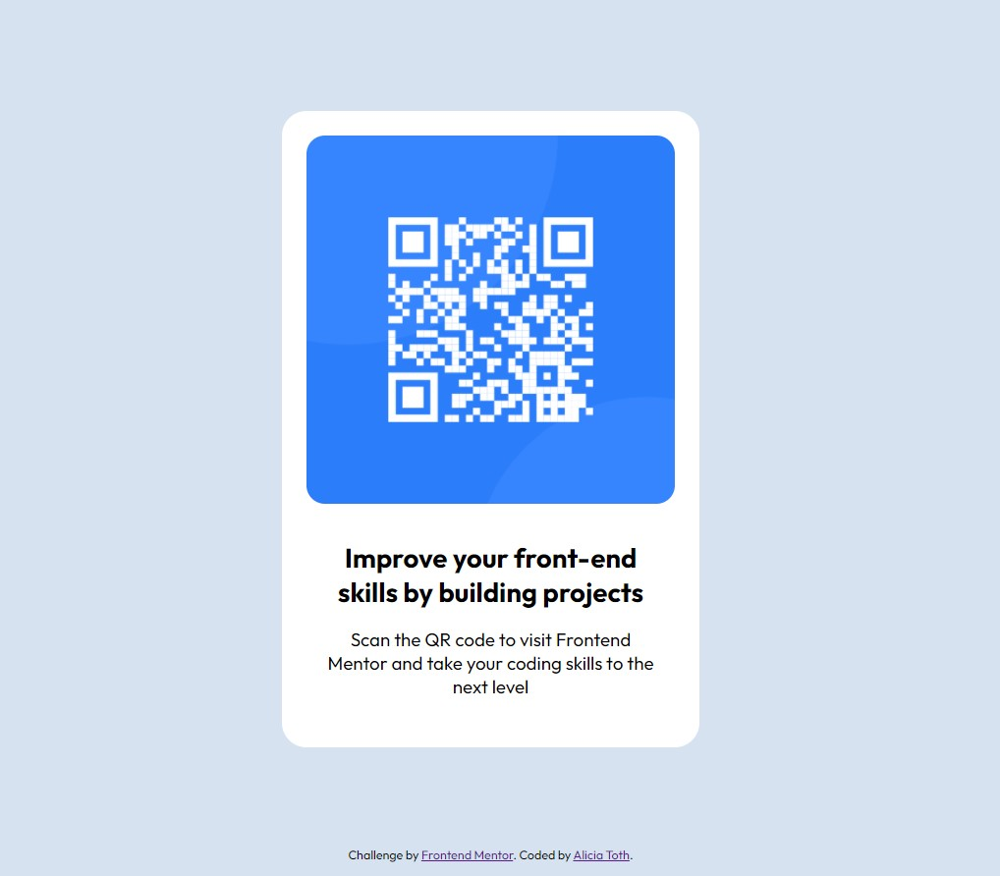

# Frontend Mentor - QR code component solution

This is a solution to the [QR code component challenge on Frontend Mentor](https://www.frontendmentor.io/challenges/qr-code-component-iux_sIO_H). Frontend Mentor challenges help you improve your coding skills by building realistic projects. 

## Table of contents

- [Overview](#overview)
  - [Screenshot](#screenshot)
  - [Links](#links)
- [My process](#my-process)
  - [Built with](#built-with)
  - [What I learned](#what-i-learned)
  - [Continued development](#continued-development)
- [Author](#author)

## Overview

Building a simple QR code component using HTML and CSS.

### Screenshot

### Links

- Solution URL: [Add solution URL here](https://your-solution-url.com)
- Live Site URL: [Add live site URL here](https://your-live-site-url.com)

## My process

### Built with

- Semantic HTML5 markup
- CSS custom properties
- CSS Flexbox

### What I learned

As my first Frontend Mentor project and GitHub repository create, I felt a little like I was lost in the woods. 

I am solidifying my HTML and CSS knowledge, and see areas of needed improvement.

### Continued development

- Understanding why/when to use: 'min-height: 100vh' in CSS. 
- When there is more than one way to acceive an outcome, knowing how to pick the best route.
- Doing another Frontend Menton Challenge.

## Author

- Frontend Mentor - [@AliciaT08](https://www.frontendmentor.io/profile/AliciaT08)
